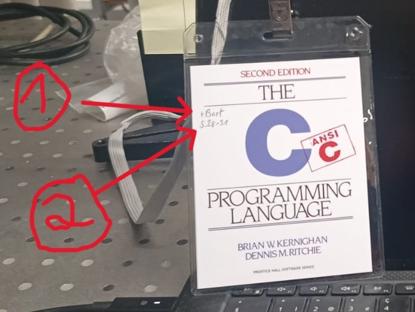

# IT-Gesamtbartvertrag

Ein Template für ein fairer und traditionserhaltender Bartvertrag für den gesamten IT-Jahrgang. 

## Vorgehen

Die folgenden Punkte gehen davon aus, dass man das Template gelesen hat und sich mit dem Konzept des "C-Buch" usw. vertraut gemacht hat. 
### Schreibphase
1. Directory für den Jahrgang erstellen mit der Struktur.  
```
├── Bartvertrag 2025
├── Bartvertrag 20$$
│   ├── Gesamtvertrag
|   ... 
│   └── $Klasse Bezeichnung$
```
2. `template.tex` in neuen `Gesamtvertrag` Directory kopieren, umbenennen und bearbeiten.
    - Wenn nötig bzw. für Archivierungszwecken werden Verträge anderer Klassen in ihren eigenen Directories unter `Bartvertrag 20$$` gesammelt. 

### Vorbereitung
Nach Einigung auf dem Vertrag und Sammlung der Unterschriften sollte die Verantwortliche Person mit dem "Frackwochen- und Alumniverein
Informatik Winterthur” koordinieren um die Archivbox zu erhalten. 

Die Seiten sollten entsprechend aufgeteilt werden und die "Erkennungshülle" vorbereitet.


Wenn neue mini-Covers gedruckt werden müssen, dann schlage ich das [Copy Print](https://www.copyprintwinti.ch/) in Winterthur vor. Die Grösse ist ungefähr 9.5cm x 12.5cm aber man kann auch die Hülle mitnehmen und sie werden wissen was sie tun müssen. Ich schlage auch vor das man eher ein dickeres Papier wählt. Das isolierte Cover ist im Repo als PDF verfügbar. 

Die "Erkennungshüllen" sollten personalisiert werden mit:
- Die Seiten des Trägers (2 im oberen Bild)
- Die optionale Verantwortung falls gewählt (1 im oberen Bild)

### Durchführung

Nach der Verteilung der Seiten und Hüllen mit Einschub und der "Letzen Rasur" beginnen die 100 Tage der Barttradition wie im Vertrag geregelt.

Beispiel für gesammelte Unterschriften und Timestamps laut `§ 8d`:


Ich schlage auch vor, dass man den unterschriebenen Bartvertrag einscannt und um entsprechenden Directory hinterlegt.

### Einsammlung

Vom "Bartab" bis und mit der Diplomfeier werden die Buchseiten mit Unterschriften der Würdigen und Hüllen mit Anhänger wieder eingesammelt. 

Einschub bleibt den Teilnehmern als Erinnerung.

### Vollendung

Ist das Buch wieder komplett, sollten es vom "IT-Vorfahre" oder der "Oberst Bartvogt" eingescannt werden und im Directory hinterlegt als Sicherheitskopie. "IT-Vorfahre" und "Oberst Bartvogt" sollten dann abmachen wie die Archivbox wieder zum "Frackwochen- und Alumniverein
Informatik Winterthur” überwiesen werden soll. 